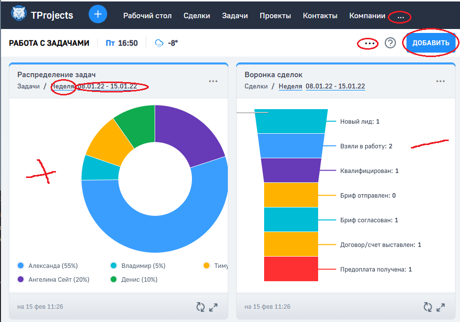

Тестовое задание

GH-Pages:
https://artem-from-spb.github.io/test-work-tprojects/

Сделано:
- сборка проекта
- установка необходимых пакетов
- подключение шрифтов
- структура по БЭМ
- публикация на gh-pages
- адаптив (без мобильной версии)
- открытие меню по кнопке (... / ДОБАВИТЬ / неделя)
- SCSS (переменные и наследование)
- календарь (без функционала)
- диаграмма 1

Доделать:
- В режиме разработки при переходе по ссылке или внесении изменений в index.js иногда пропадают картинки (лечится ctrl-S на index.html)
- Диаграмма 2 (сейчас заглушка)
- Календарь оживить
- Оптимизация кода (классы или переписать на реакт)
- Pixel perfect
- Контакты
- Верстка оставшихся элементов

Активно:

